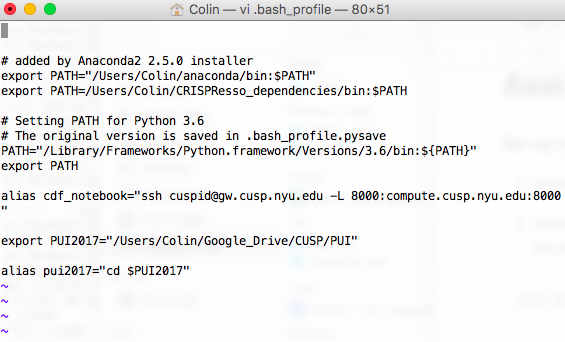
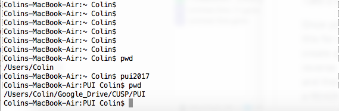

# PUI2017_cra354

### Setting Up Environment

To set up my environment I went to my home directory and opened my .bash_profile for editing with these commands:
```
cd
vi .bash_profile
```

Then inside the vi editor I added these two lines to create an environmental variable and alias respectively:
```
export PUI2017="/Users/Colin/Google_Drive/CUSP/PUI"
alias pui2017="cd $PUI2017"
```

This is what my .bash_profile looks like now (some text on top is unrelated to PUI):


After Running these commands:
```
pwd
pui2017
pwd
```
This was the output:



